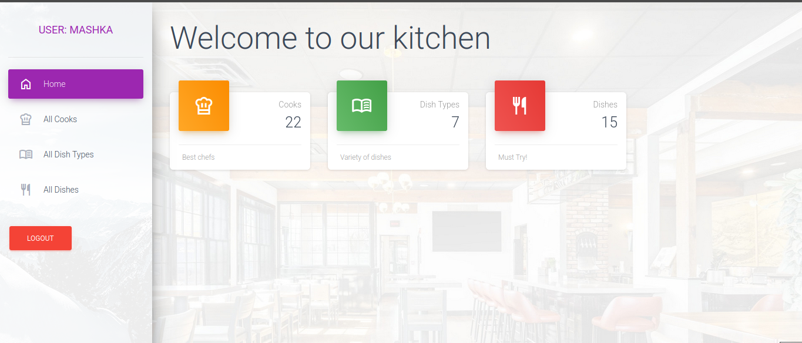

# shynok

The project is designed to organize the work of a restaurant.
Cooks are users among whom work can be flexibly distributed.
All dishes are divided into types and have detailed descriptions.

## Installing using GIT
```bash
   git clone https://github.com/Komar88lvl/shynok.git
   cd shynok
   python3 -m venv .venv
```

- Requirement installation:

## Linux/macOS:
```bash
  source .venv/bin/activate
  pip install -r requirements.txt
  touch .env
```

## Windows:
```bash
  source .venv\Scripts\activate
  pip install -r requirements.txt
  touch .env
```

Set up .env file
There is an example in .ent.sample

After .env settings:
```bash
  python manage.py migrate
  python manage.py createsuperuser
  python manage.py runserver
```


## Features:
* Authentification functionality for Cook/User
* Managing dishes cooks & dish types directly from website interface
* Powerful admin panel for advanced managing


## Demo

